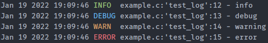

# clogger

simple error messaging and logging system in C



## How to use?

### Console

 - *to activate colors compile with -DLCOLOR*

```C
FILE *file = fopen(file_path, "a");
if (file == NULL) {
        LOG_ERROR("fopen() failed. (%s)", strerror(errno));
        exit(EXIT_FAILURE);
}
```

### File

```C
LOG_ERROR_F("logs/errors.txt", "some crazy shit happened!!!. (%s)", cause);
```
